# LAB-40-Tunnel  
Jum'at 22 Agustus 2025  
  
# Interkoneksi jaringan dengan Tunnel  
  IP in IP atau biasa dikenal dengan IPIP merupakan salah satu tunnel pada MikroTik yang implementasinya berdasarkan RFC2003. Banyak perangkat router yang sudah mendukung fitur IPIP ini. IPIP bisa digunakan untuk mengkoneksikan 2 jaringan yang berbeda melalui jaringan internet. Cara kerjanya, yaitu dengan mengenkapsulasi paket data dari satu IP ke IP yang lain untuk membentuk network tunnel.  

# Konfigurasi IP in IP Tunnel  
  
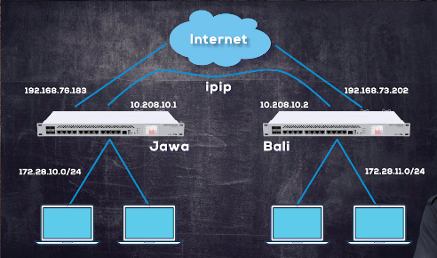  
  
# Konfigurasi IP in IP Tunnel Server di Router 1  
  
  1. Pastikan R1 sudah memiliki konfigurasi dasar sampai terhubung ke internet.  
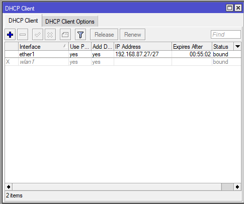  
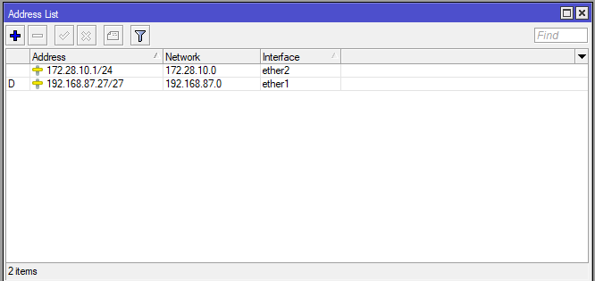  
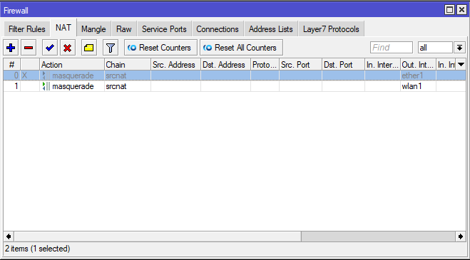  
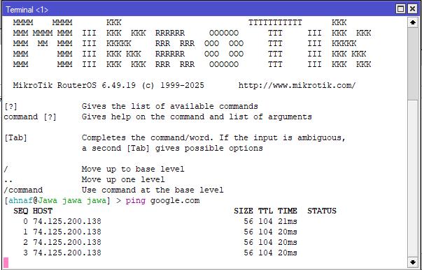  
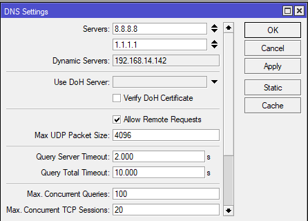  
  3. Jika sudah, sekarang konfigurasi IP Tunnel di Router Jawa. di **Interfaces > IP Tunnel**. Masukan Local Address dan Remote Address. Local address adalah IP Public dari router 1 (Jawa), dan remote Address adalah IP Public dari router tujuan (Bali). Cukup ini yang perlu dikonfigurasi di IP Tunnel.  
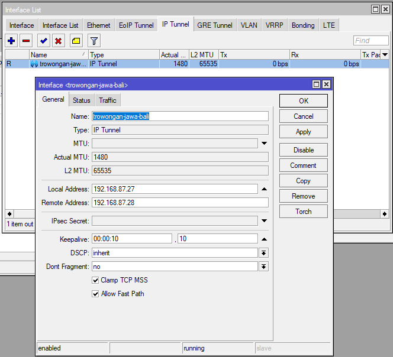  
  4. Selanjutnya tambahkan IP Address untuk Interface IP Tunnel Jawa-Bali. IP Addresnya 10.208.10.1 dan Network isi dengan 10.108.10.2 yang akan digunakan di interface IP Tunnel Router 2 (Bali), lalu Interfacenya pilih ke ip tunnel, jika sudah APPLY dan OK.  
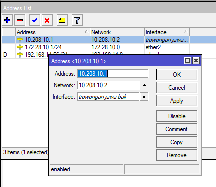  
  5. Untuk menghubungkan LAN dari Router Jawa ke Bali, kita bisa pake static routing. Untuk Dst Address, kita isikan IP LAN Router Balinya, dan gatewaynya adalah IP dari Interface IP Tunnel Router Bali.  
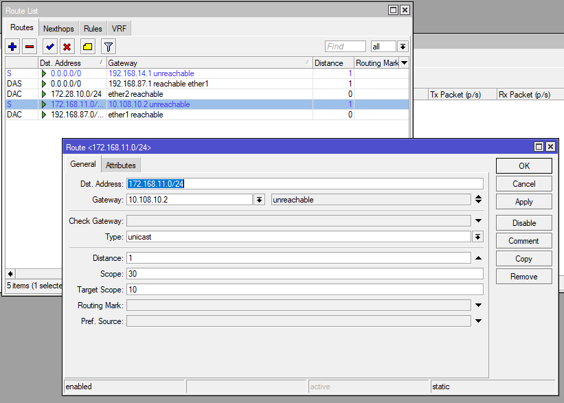  
  
# Konfigurasi IP in IP Tunnel Client di Router 2  
1. lakukan konfigurasi dasar  
2. jika sudah terhubung ke internet kita pilih menu       
   interfaces > ip tunnel      
3. klik (+)  
4. masukkan nama (opsional)  
   lalu local address : ip publik bali   
   remote address : ip publik jawa   
   klik ok  

5. jika muncul flag R maka artinya router bali dan jawa sudah terhubung

6. lalu kita tambahkan ip address untuk interface ip tunnel bali-jawa    
   pilih menu ip > address   
   klik (+)   
   address : ip yang sudah di berikan router jawa 10.208.10.2  
   network : ip address router jawa 10.208.10.1   

7. lalu coba ping ke router jawa

8. lalu kita buatkan routing  
   pilih menu ip > routes   
   klik (+)   
   dst.address adalah ip lan dari router jawa  
   gateway : 10.208.10.1  

9. kita coba tes di laptop lewat cmd bukti bahwa bisa berkomunikasi 

  
# Pengujian  
1. Lakukan ping dari Router 1 ke 2 dan sebaliknya  
Laptop 1  
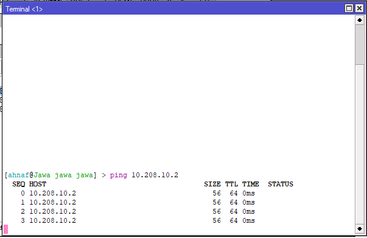  
Laptop 2  
  
3. Lakukan ping dan tracert dari Laptop 1 ke 2  
Laptop 1  
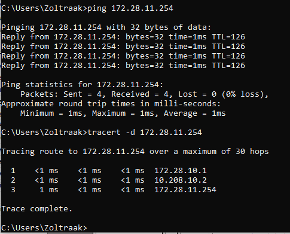  
Laptop 2  
  

# Kesimpulan  
  IPIP digunakan untuk mengkoneksikan 2 jaringan yang berbeda melalui jaringan internet. IPIP merupakan salah satu tunnel pada MikroTik yang implementasinya berdasarkan RFC2003.   
  
# Sumber
Youtube - Citraweb - https://www.youtube.com/watch?v=icnJrQjiUW4&t=2s  
